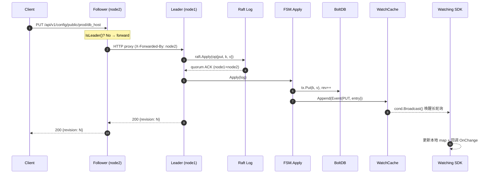
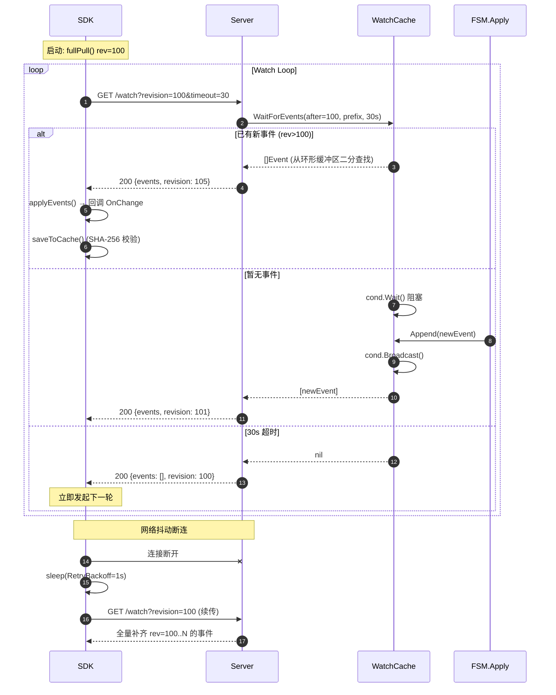
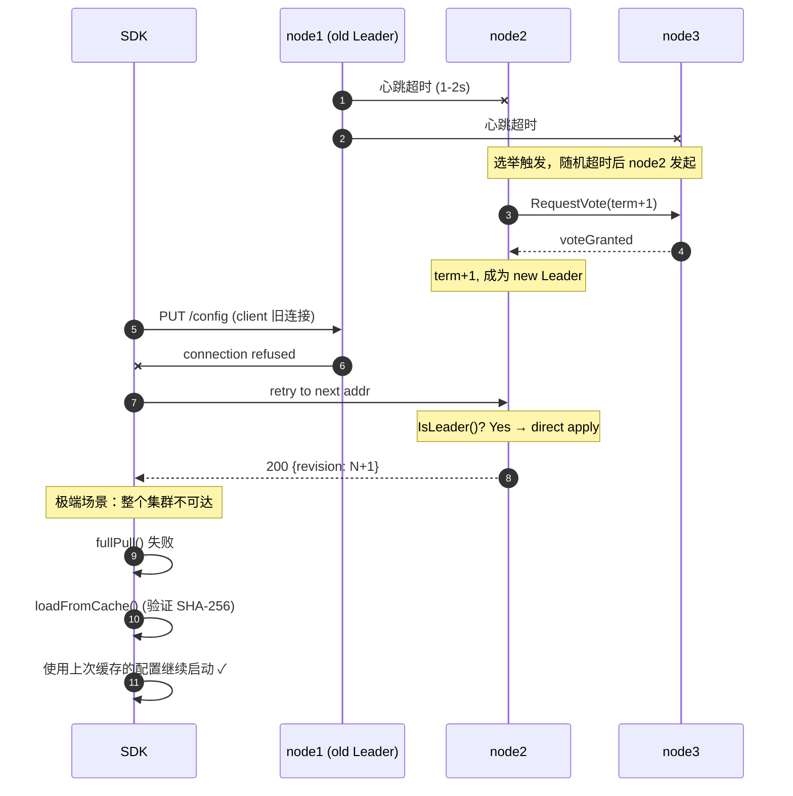

<div align="center">

# PaladinCore

**7 天从零实现的分布式配置中心 · 用 ~2000 行 Go 代码讲透 Raft + Watch + SDK 的工程哲学**

[](https://golang.org/dl/)
[](https://github.com/hashicorp/raft)
[](https://github.com/etcd-io/bbolt)
[](LICENSE)
[]()
[](CONTRIBUTING.md)

_**Built to be read, not just to be run.**_
每一层都配一篇教程，每个决策都写清楚"为什么不这么做"。

[快速开始](#-快速开始) · [架构](#-架构全景) · [7 天教程](#-7-天教程目录) · [API](#-http-api-一览) · [与原版对比](#-与-bilibili-paladin-原版的对比)

</div>

---

## ✨ 为什么还要再写一个配置中心？

市面上已经有 etcd、Apollo、Nacos、Paladin，**PaladinCore 的价值不在"用"，而在"读懂"**。
它是受 [GeeCache](https://geektutu.com/post/geecache.html) 教学哲学启发的一次实践：

> **"用最少的代码，把一个生产级系统最硬核的 3 个点讲透：**
> **一致性 (Raft FSM)、实时性 (Watch 长轮询)、可用性 (SDK 降级)。"**

如果你正在：
- 🎯 面试分布式系统岗位，想系统讲清楚 **Raft 日志复制 → FSM Apply → Watch 通知**的完整链路
- 🔬 研究 etcd / Paladin 源码，却被 23000+ 行的装饰器、代码生成、多版本 API 劝退
- 🛠 想亲手实现一遍 **长轮询环形缓冲区**、**Leader 转发**、**SDK 三级降级**
- 📖 想理解为什么工业界的配置中心普遍选 CP 而不是 AP

**那么这 7 篇教程 + 2000 行代码就是为你准备的。**

---

## 🧠 核心设计一览

<table>
<tr>
<th width="20%">维度</th><th width="40%">PaladinCore 的选择</th><th width="40%">为什么这么选</th>
</tr>
<tr>
<td><b>一致性模型</b></td>
<td>CP — Raft 强一致</td>
<td>配置中心的读多写少场景里，<i>错误配置的扩散代价</i>远大于写入延迟。宁可丢可用性也不能让两个节点读到分叉的配置。</td>
</tr>
<tr>
<td><b>写路径</b></td>
<td>所有写请求走 Raft 日志</td>
<td>BoltDB 的单写者模型 (single-writer) 与 Raft 的 <i>只有 Leader 能写</i> 天然契合，省掉了 CAS 循环和额外锁。</td>
</tr>
<tr>
<td><b>读路径</b></td>
<td>默认本地读（允许 stale），<code>?consistent=true</code> 可升级</td>
<td>配置变更本来就是异步推送模型，读取侧 Follower 延迟 &lt; 一次 Watch RTT，业务无感知。</td>
</tr>
<tr>
<td><b>通知机制</b></td>
<td>HTTP 长轮询 + 环形缓冲区</td>
<td>长轮询穿透所有中间件/负载均衡器；环形缓冲区让 <code>revision &gt; N</code> 的事件查找降到 <code>O(log n)</code>，重连客户端无需全量拉取。</td>
</tr>
<tr>
<td><b>客户端路由</b></td>
<td>ForwardRPC — Follower 透明代理写</td>
<td>客户端 <b>不需要感知谁是 Leader</b>。打到任何节点的写请求都会被正确路由，Leader 切换期间只需 1-3s 的静默重试。</td>
</tr>
<tr>
<td><b>SDK 降级</b></td>
<td>三级：全量 → 长轮询 → 本地缓存 (SHA-256 校验)</td>
<td>配置中心<b>挂了整个集群挂</b>。本地缓存 + 校验和兜底，让服务即使在启动时配置中心完全不可达，也能用上次的配置正常启动。</td>
</tr>
</table>

---

## 🏛 架构全景

### 系统分层（d2）

```d2
direction: down

client: "客户端 (业务服务)" {
  shape: person
}

sdk: "PaladinCore SDK" {
  shape: rectangle
  style.fill: "#E3F2FD"

  pull: "① 启动全量拉取"
  watch: "② 长轮询增量订阅"
  cache: "③ 本地缓存 (SHA-256)" {
    shape: cylinder
  }
}

cluster: "Raft 集群 (3 节点)" {
  style.fill: "#FFF3E0"

  leader: "Leader\n(node1)" {
    shape: hexagon
    style.fill: "#FFB74D"
    style.bold: true

    api: "HTTP API\n/api/v1/config"
    raft_core: "Raft Core\n(hashicorp/raft)"
    fsm: "FSM.Apply"
    wcache: "WatchCache\n(ring buffer)" {
      shape: cylinder
    }
    boltdb: "BoltDB\n(data.db)" {
      shape: cylinder
    }
    raftlog: "Raft Log\n(raft-log.db)" {
      shape: cylinder
    }

    api -> raft_core: "write"
    raft_core -> fsm: "commit"
    fsm -> boltdb: "persist"
    fsm -> wcache: "append event"
    raft_core -> raftlog: "append log"
  }

  follower1: "Follower\n(node2)" {
    shape: hexagon
    style.fill: "#90CAF9"
    forward: "ForwardRPC"
    fsm2: "FSM.Apply"
    boltdb2: "BoltDB" {
      shape: cylinder
    }
  }

  follower2: "Follower\n(node3)" {
    shape: hexagon
    style.fill: "#90CAF9"
    forward: "ForwardRPC"
    fsm3: "FSM.Apply"
    boltdb3: "BoltDB" {
      shape: cylinder
    }
  }

  leader.raft_core -> follower1.fsm2: "AppendEntries"
  leader.raft_core -> follower2.fsm3: "AppendEntries"
  follower1.forward -> leader.api: "write proxy"
  follower2.forward -> leader.api: "write proxy"
}

client -> sdk.pull: "Get / OnChange"
sdk.pull -> cluster.leader.api: "GET /config/..."
sdk.watch -> cluster.follower1: "GET /watch (long-poll)"
sdk.cache <-> sdk.pull: "fallback"
```

### 模块依赖（d2）

```d2
direction: right

cmd: "cmd/paladin-core\n(main.go)" {
  shape: rectangle
  style.fill: "#C8E6C9"
}

server_pkg: "server/" {
  style.fill: "#FFE0B2"
  server_go: "server.go\nHTTP CRUD"
  watch_go: "watch.go\n长轮询"
  raft_server: "raft_server.go\nForwardRPC + /admin"
}

raft_pkg: "raft/" {
  style.fill: "#FFCDD2"
  node: "node.go\nRaft Node + FSM"
}

store_pkg: "store/" {
  style.fill: "#B3E5FC"
  iface: "store.go\nStore interface"
  bolt: "bolt.go\nBoltDB impl"
  watch: "watch.go\nWatchCache (ring buf)"
  watchable: "watchable.go\n存储+事件桥梁"
}

sdk_pkg: "sdk/" {
  style.fill: "#F8BBD0"
  client: "client.go\n三级降级客户端"
}

cmd -> server_pkg
cmd -> raft_pkg
cmd -> store_pkg
server_pkg.raft_server -> raft_pkg
raft_pkg -> store_pkg.watchable
store_pkg.watchable -> store_pkg.bolt
store_pkg.watchable -> store_pkg.watch
server_pkg.watch_go -> store_pkg.watch
sdk_pkg -> server_pkg: "HTTP"
```

---

## 🎬 核心链路时序

### 写入链路：客户端 PUT → Raft 复制 → Watch 推送



### 订阅链路：SDK Watch 长轮询（含断连重连）



### 故障恢复：Leader 宕机 + SDK 缓存兜底



---

## 🚀 快速开始

### 前置要求
- Go 1.23+
- Docker & Docker Compose（可选，用于集群模式）

### 单机模式（Day 1-3：学 KV + Watch）
```bash
go run ./cmd/paladin-core serve :8080
```

另开一个终端验证：
```bash
# 写入
curl -X PUT http://localhost:8080/api/v1/config/public/prod/db_host -d 'mysql.prod:3306'

# 读取
curl http://localhost:8080/api/v1/config/public/prod/db_host

# 长轮询订阅（会阻塞 30s 或直到新事件）
curl 'http://localhost:8080/api/v1/watch/public/prod/?revision=0&timeout=30'
```

### 三节点 Raft 集群（Day 4-7：学分布式）
```bash
docker compose up -d

# 观察 3 节点选举日志
docker compose logs -f

# 验证集群状态（node1:8080, node2:8081, node3:8082）
curl http://localhost:8080/admin/stats | jq
```

### 本地 CLI（调试必备）
```bash
go run ./cmd/paladin-core put  app/v1/timeout   "5s"
go run ./cmd/paladin-core get  app/v1/timeout
go run ./cmd/paladin-core list app/
go run ./cmd/paladin-core rev
```

### SDK 集成（最佳实践）
```go
import "github.com/smy/paladin-core/sdk"

c, err := sdk.New(sdk.Config{
    Addrs:        []string{"node1:8080", "node2:8080", "node3:8080"},
    Tenant:       "public",
    Namespace:    "prod",
    CacheDir:     "/var/cache/paladin",  // 强烈建议配置，用于降级
    PollTimeout:  30 * time.Second,
    RetryBackoff: 1 * time.Second,
})
if err != nil { log.Fatal(err) }
defer c.Close()

// 同步读取（纯内存，无网络开销）
host, _ := c.Get("public/prod/db_host")

// 订阅变更 —— 热更新的核心
c.OnChange("public/prod/db_host", func(key string, old, new []byte) {
    log.Printf("config changed: %s: %q → %q", key, old, new)
    reconnectDB(string(new))
})

// 订阅整个 namespace
c.OnChange("", func(key string, old, new []byte) { /* ... */ })
```

---

## 📚 7 天教程目录

每篇文档不止讲"怎么写"，更讲 **"为什么不那样写"**——对比 etcd、Paladin、Consul 的设计权衡。

| Day | 主题 | 核心概念 | 代码量 | 教程 |
|-----|------|---------|--------|------|
| 1 | **KV Store** | BoltDB 事务 · 全局 revision 逻辑时钟 · `Create/Mod/Version` 四位一体 | ~300 行 | [📖 day1-kv-store.md](doc/day1-kv-store.md) |
| 2 | **HTTP API** | RESTful 路由 · `tenant/namespace/name` 多租户 · JSON 包装器 | ~260 行 | [📖 day2-http-api.md](doc/day2-http-api.md) |
| 3 | **Watch** | 环形缓冲区 · `sync.Cond` 长轮询 · 事件按 revision 二分查找 | ~400 行 | [📖 day3-watch.md](doc/day3-watch.md) |
| 4 | **Raft** | HashiCorp Raft · FSM 设计 · Snapshot 与日志压缩 | ~330 行 | [📖 day4-raft.md](doc/day4-raft.md) |
| 5 | **ForwardRPC** | Leader 透明代理 · `VerifyLeader` 一致性读 · 故障转移 | ~240 行 | [📖 day5-forward-rpc.md](doc/day5-forward-rpc.md) |
| 6 | **Go SDK** | 启动全量拉取 · 长轮询循环 · 本地缓存 + SHA-256 兜底 | ~280 行 | [📖 day6-sdk-client.md](doc/day6-sdk-client.md) |
| 7 | **集群部署** | Docker Compose · `--bootstrap` / `--join` 协议 · 健康检查自愈 | ~100 行 | [📖 day7-cluster-deploy.md](doc/day7-cluster-deploy.md) |

> 💡 **建议阅读顺序**: Day1 → Day2 → Day3 先把单机跑通，再 Day4 → Day5 引入 Raft，最后 Day6 → Day7 把 SDK 和部署闭环。

---

## 🗂 项目结构

```text
paladin-core/
├── cmd/paladin-core/
│   └── main.go                      # 入口：serve / cluster / put / get / list / rev
├── store/                           # 【Day 1 + Day 3】存储层
│   ├── store.go                     #   - Store 接口 + Entry 定义（revision 四元组）
│   ├── bolt.go                      #   - BoltDB 实现（事务 + revision 原子递增）
│   ├── watch.go                     #   - WatchCache 环形缓冲区（sync.Cond 长轮询）
│   └── watchable.go                 #   - WatchableStore：Put/Delete 自动投递事件
├── server/                          # 【Day 2 + Day 3 + Day 5】HTTP 层
│   ├── server.go                    #   - CRUD + 多租户路径解析
│   ├── watch.go                     #   - /api/v1/watch/... 长轮询端点
│   └── raft_server.go               #   - Raft 感知：写请求走 Apply，非 Leader 转发
├── raft/                            # 【Day 4】共识层
│   └── node.go                      #   - Raft Node + FSM.Apply + Snapshot/Restore
├── sdk/                             # 【Day 6】客户端
│   └── client.go                    #   - fullPull → watchLoop → localCache 三级降级
├── doc/                             # 【教程】7 篇深度讲解
│   ├── day1-kv-store.md
│   ├── day2-http-api.md
│   ├── day3-watch.md
│   ├── day4-raft.md
│   ├── day5-forward-rpc.md
│   ├── day6-sdk-client.md
│   └── day7-cluster-deploy.md
├── Dockerfile                       # 多阶段构建，静态二进制
├── docker-compose.yml               # 3 节点集群一键启动
├── go.mod / go.sum
└── README.md
```

---

## 🌐 HTTP API 一览

### 配置操作（路径 = `tenant/namespace/name`）

| Method | Path | 说明 | 备注 |
|--------|------|------|------|
| `GET` | `/api/v1/config/{t}/{ns}/{name}` | 读取单个配置 | 本地读（Follower 可能略有延迟） |
| `PUT` | `/api/v1/config/{t}/{ns}/{name}` | 创建/更新 | 走 Raft，Follower 自动转发 |
| `DELETE` | `/api/v1/config/{t}/{ns}/{name}` | 删除 | 走 Raft |
| `GET` | `/api/v1/config/{t}/{ns}/` | 按 namespace 列举 | 前缀扫描 |
| `GET` | `/api/v1/config/{t}/` | 按 tenant 列举 | 前缀扫描 |
| `GET` | `/api/v1/rev` | 获取当前全局 revision | 调试/SDK 对齐用 |

### Watch 长轮询

| Method | Path | Query | 说明 |
|--------|------|-------|------|
| `GET` | `/api/v1/watch/{t}/{ns}/` | `?revision=N&timeout=30` | 阻塞直到有 `rev > N` 的事件或超时 |

### 集群管理

| Method | Path | 说明 |
|--------|------|------|
| `POST` | `/admin/join?id=X&addr=host:port` | 把新节点加入集群（只能发往 Leader） |
| `POST` | `/admin/leave?id=X` | 移除节点 |
| `GET` | `/admin/stats` | 查看 Raft 状态（term / index / leader / …） |
| `GET` | `/healthz` | 健康检查（Docker healthcheck 用） |

### 响应头

| Header | 说明 |
|--------|------|
| `X-Paladin-Revision` | 当前集群 revision（便于客户端对齐时序） |
| `X-Forwarded-By` | 该请求被哪个 Follower 转发（调试追踪用） |

---

## 🔬 与 Bilibili Paladin 原版的对比

PaladinCore 刻意做了大量**减法**——保留精髓，去掉工业级脚手架。

| 维度 | 原版 Paladin (~23,000 行) | PaladinCore (~2,000 行) | 为什么砍掉？ |
|------|--------------------------|-------------------------|------------|
| API 版本管理 | K8S 风格多版本 + code-gen | 单版本 v1 | 教学不需要 API 演进策略 |
| 存储层 | 多层装饰器 (cache/metrics/trace) | `BoltStore` + `WatchableStore` | 看清数据流比看解耦更重要 |
| RPC | 自定义 GoRPC + protobuf | HTTP 转发 | HTTP 可直接用 curl 调试 |
| ACL | 完整 RBAC + JWT 签名 | 预留 JWT 扩展点 | 安全是独立主题，不在本项目范围 |
| Message 模块 | 运维公告/事件广播 | ❌ 不实现 | 与"配置中心"核心职责正交 |
| 指标/追踪 | Prometheus + OpenTracing 全埋点 | 极简 log.Printf | 第一次读代码时指标反而是噪音 |
| Web UI | 独立前端管理台 | ❌ | curl + jq 已经够用 |

> 👉 **读完 PaladinCore 再回头读 Paladin，你会发现那 21000 行"多出来"的代码，每一处都有其工程必然性。**
> 这正是本项目的终极目标：**让你读懂一个生产系统的"骨架"，就像读一张 X 光片一样清晰。**

---

## ✅ 测试

```bash
# 运行所有单元测试
go test ./...

# 单独测试某层
go test ./store/... -v     # 存储层 & WatchCache
go test ./server/... -v    # HTTP API & Watch 端点
go test ./raft/...  -v     # Raft FSM & Snapshot
go test ./sdk/...   -v     # SDK 全量拉取 & 长轮询
```

本地集成测试（需要先 `docker compose up -d`）：
```bash
# 通过 node2 (Follower) 写入，验证透明转发
curl -X PUT http://localhost:8081/api/v1/config/public/prod/flag -d 'on'

# 从 node3 读取，验证一致性
curl http://localhost:8082/api/v1/config/public/prod/flag
```

---

## 🗺 路线图

已完成：
- [x] Day 1-7 核心路径全部打通
- [x] Docker Compose 三节点集群
- [x] SDK 三级降级 + SHA-256 校验

计划中：
- [ ] 一致性读（`?consistent=true` → `raft.VerifyLeader`）
- [ ] JWT token 鉴权中间件
- [ ] gRPC Watch 流式 API（长轮询 v2）
- [ ] Prometheus `/metrics` 端点（可选择性启用）
- [ ] Chaos 测试脚本（随机 kill 节点验证自愈）

---

## 📖 延伸阅读

- [HashiCorp Raft Interface 官方文档](https://pkg.go.dev/github.com/hashicorp/raft)
- [Raft 论文 (In Search of an Understandable Consensus Algorithm)](https://raft.github.io/raft.pdf)
- [etcd 存储层解析](https://etcd.io/docs/v3.5/learning/data_model/)
- [Bilibili Paladin 原版仓库](https://github.com/bilibili/paladin)
- [GeeCache: 7 天 Go 语言分布式缓存](https://geektutu.com/post/geecache.html)（本项目的教学哲学源头）

---

## 🤝 贡献

欢迎任何形式的贡献——教程里的错别字、代码的性能优化、对设计决策的质疑都可以。
请先 open issue 讨论大的改动，避免浪费彼此时间。

---

## 📜 License

MIT. 代码仅供学习，不提供任何生产环境担保。
如果你觉得有帮助，**欢迎点一颗 ⭐**——这是继续写这种"把系统讲透"的项目最大的动力。
